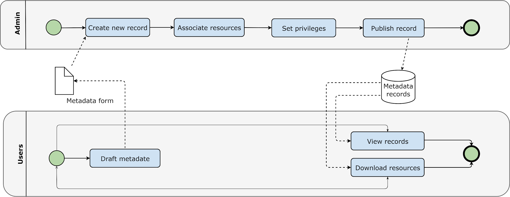
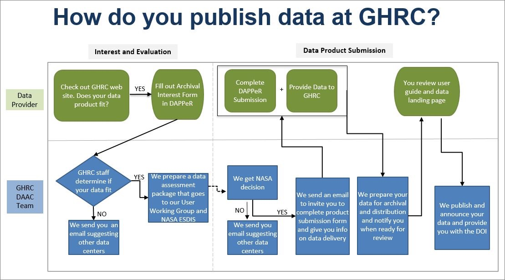

# Data Standardization

## Data Authenticity

### Quality

### Interoperability

Naming, numbering system

### Standard keyword definition

#### BWRAP Keywords

- BWRAP Team
  - Internal
  - Partners/Collaborators
    - ABMI
    - GOA
    - RICC
  - External
    - Government of Canada
    - Google Earth Engine
    - Google BigQuery
    - NOAA
- Ecosystem
  - Soil
  - Water
  - Vegetation
    - Tree
    - Shrub
    - Grass
    - Hybrid
- Weather
  - Temperature
  - Humidity
- Data Format
  - Raster
    - RGB
    - Multispectral
    - Hypersepctral
    - Thermal
    - Thematic Layer
  - Vector
    - Point
    - Line
    - Polygon

### BERA Keywords

- BERA Team
  - All Teams
  - BERA Study Area
    - Kirby
    - LiDEA I
    - LiDEA II
    - Surmont
    - BERA Tools
  - Ecological
  - Remote Sensing
    - Seedling
    - Softcopy
    - Treatment
    - Forest Line Mapper
  - Soil and Ecohydrology
- External
  - ABMI
  - Alberta Environmental and Parks
  - AltaLIS
  - Cenovus
  - Government of Canada
  - CFS
  - COSIA
  - FRIAA
  - Imperial
  - JEM Sites
  - RICC

## Data compatibility

### Data Formats

Recommended data formats to prepare data:

- **Shapefile**
    A shapefile is a common file format used in GIS to store and manage geospatial data. It is a digital vector format that contains the geometric shapes of geographic features, such as oints, lines, and polygons, as well as their associated attributes, such as names, IDs, and descriptions.

- **GeoPackage**
    GeoPackage is a direct replacement for ESRI file geodatabase.

    GeoPackage is an open, platform-independent, and standards-based format that was developed by the Open Geospatial Consortium (OGC) and released in 2014.

    GeoPackage files can store various types of geospatial data, including vector features, raster images, and tiles. They can also include metadata that describes the contents of the file, such as coordinate reference system (CRS) information and attribute schemas.

- **GeoTiff**
    GeoTiff is recommended for storing raster data.

    GeoTIFF is a file format for storing georeferenced raster images. It is a variant of the TIFF (Tagged Image File Format) file format. In addition to geographic metadata, a GeoTIFF file can also store other types of metadata, such as color maps, image statistics, and compression settings. This makes it a versatile and powerful format for storing and analyzing raster data.

- **NetCDF/HDF/GRIB**
    NetCDF4/ HDF5 /GRIB are for large and multi-dimensional datasets. NetCDF (Network Common Data Form) is a data format for storing multidimensional data. This data can be temperature, humidity, pressure, wind speed and direction in both vector and raster format.

    GRIB (General Regularly-distributed Information in Binary) is a data format that stores meteorological data and forecast weather data. The GRIB raster type allows two formats GRIB 1 and GRIB 2. This also stores a large number of rasters with different dimensions in mosaic images.

    HDF (Hierarchical Data Format) is a format designed by the National Center for Supercomputing Applications (NCSA) to store scientific data. The HDF raster type data format allows the user to add multiple raster data in HDF4 or HDF5 format in an image mosaic. Image mosaic is a merge of two or more datasets.

    NetCDF4 uses a subset of HDF5 features, and adds some new features. NetCDF4 reads/writes specially structured HDF5 files. The main idea behind NetCDF4 is a simpler API than HDF5, while maintaining the same performance.

    Python h5py makes HDF5 read/write very easy. NetCDF4 is a little more complicated to use from Python.

### projection

GeoServer supports broad selection of GCS, but EPSG 4326 is better supported by applications.

For layers saved in PostGIS and are supposed to be edited later through web applications, EPSG 4326 is strongly recommended.

- **No-geospatial Data**

Editors can upload all kinds of files as metadata attachments.

Administrators are responsible for publishing geospatial data to GeoServer.

#### Authorizing bodies

### Metadata

#### Best Practices for Metadata Creation

- Gather all information together, especially if multiple people have information that you need.

- Use information that is already developed.
  - Re-use text from grant or funding proposals (e.g. abstract, purpose, date, etc.).
  - Reference the data dictionary that was used during data collection and processing to complete the Entity & Attribute section of a ISO metadata record.

- Choose a descriptive title for your data that incorporates who, what, where, when, and scale.
  - The single most important text in the metadata record is the title because it is the main thing people will see in metadata catalogs.
    - Example template: \[Measurement\] of \[phenomenon\] in \[geographic feature\] at \[geographic location\] during \[timeframe\]
    - Examples:
      - Aerial imagery and photogrammetric products from unmanned aerial systems (UAS) flights over the wetland at Cold Lake,Alberta, July 12 to 14, 2023
      - Trails from 1:120,000 Banff National Park Visitor Maps between 1961-1983

- Choose keywords wisely: Consider all of the possible interpretations     of your word choices and use a thesaurus to add descriptive terms you may not have otherwise selected.

- Placement of the DOI for the data in a ISO metadata record
  - The DOI should go in the primary \<onlink\> in the Citation Information section.
  - Make sure that the format of the DOI is a URL, (not of the format <doi:10.5066/ABCD123>). Your DOI should be entered in the format <https://doi.org/10.5066/ABCD123>.

- Placement of the DOI for the related publication in a ISO record
  - The related publication is usually cited as a Larger Work Citation in the metadata. The Larger Work Citation has its own \<onlink\> field, and this is the correct location for the publication\'s DOI.
  - Make sure that the format of the DOI is a URL, (not of the format <doi:10.3133/ABCD123>). Your DOI should be entered in the format <https://doi.org/10.3133/ABCD123>. If your DOI is not entered as a URL.

- Include as many details as you can in the metadata record for future users of the data.
- Whenever you change your metadata record, update the metadata date (date stamp) so that metadata repositories will know which version of the record is most recent.

### Data Publishing Workflow

#### Basic Workflow

1. Editor (user with editing privilege) create new metadata
2. Editor package clean data in zip format (less than 100M), upload it to portal
3. Editor create link to the uploaded data
4. If the zip file is larger than 100M, editor notify administrator to retrieve the data
5. Administrator upload the data to portal server or create link information for the data

#### Data Files Naming Convention

1. no spaces and no special characters (except an underscore \_ )

2. Do not start file names, field headings, folder names, or MXD names with a number or underscore
    Example:
  
    **BWRAP_Study_Area.shp**

#### Clean and Validate the Data

### Data Uploading

#### Publish Data to GeoServer

1. Data Store
    1. Use GeoTiff for raster format
    2. Use shapefile fo single table raster
    3. Use Geopackage for file-based geodatabase

2. Publish Data
    Data publishing is done by Admins from the server or lab machine connected with intranet.

3. GeoWebCache
    GeoWebCache is used to cache web map tiles to accelerate map services.

4. ImageMosaic
    ImageMosaic can be used to serve multiple tiles [simultaneously](https://www.google.com/search?newwindow=1&rlz=1C1GCEB_enCA960CA960&q=simultaneously&spell=1&sa=X&ved=2ahUKEwir1dXf5Lj9AhWxIzQIHZEGB6cQkeECKAB6BAgIEAE). This works well for multiple scenes of rasters such as satellite and drone images.

5. ImagePyramid

#### Data Formats to Consider

##### Raster

- las for LiDAR (visualization?)
- GeoTiff
- Common photo formats (e.g. site pictures): jpeg, png, gif etc.
- MrSID
- FLS (terrestrial data)?
- ADF (ESRI ArcGRID)
- BIN, raw data
- DAT, DEM data
- ASC, LiDAR

##### Vector

- shapefile
- File geodatabase
- Kml, kmz
- RTK files, binary, text
- JSON, GeoJSON
- HDF, NetCDF

##### Other

- CSV xlsx, xlxm etc.
- Docx, doc etc.
- Pdf
- FGDC metadata, html

##### Formats Directly Supported by GeoServer

- **Vector**
  - Shapefile
  - Geopackage
  - Database
    - PostGIS
    - H2
- **Raster**
  - GeoTiff
  - MrSID
  - ArcGRID
  - ERDAS Imagine
  - ECW
  - NetCDF
  - GRIB
  - HDF

#### Preparing different types of data

##### Satellite Data

- Down scaled mosaic or single scene
- Raster footprint
- Report

|      | Item                      | Description                        |
-------|-------------------------- | -----------------------------------|
| -    | Raster                    | Down scaled mosaic or single scene |
| -    | Footprint(s)              | Raster footprint(s)                |
| -    | Report                    | Technical report or detailed       |
|      |                           | metadata document                  |

**Satellite Data**

Refer to:

<https://docs.geoserver.org/main/en/user/data/raster/gdal.html#supporting-vector-footprints>

##### Drone data

Information related to drone images:

- Flight plan
- Image center coordinates table (shapefile)
- Image footprints
- Orthophoto
- Point Cloud
- Processing quality report

Checklist for Drone Images

|      | Item                      | Description                        |
-------|---------------------------|------------------------------------|
| -    | Flight plan               | Down scaled mosaic or single scene |
| -    | Image center coordinates  | shapefile                          |
| -    | table                     |                                    |
| -    | Image footprints          |                                    |
| -    | Orthophoto                |                                    |
| -    | Point Cloud               |                                    |
| -    | Processing quality report |                                    |

Checklist for Drone Images

## Data Management Plan

### Introduction

A data standard is a type of standard, which is an agreed upon approach to allow for consistent measurement, qualification or exchange of an object, process, or unit of information. For example, the metric system of measurement is a standard.

Data standards refer to methods of organizing, documenting, and formatting data in order to aid in data aggregation, sharing and reuse.

There are many data standards, and data standards can be generated by a research community (e.g., Observational Health Sciences and informatics (OHDSI), a governmental organization (e.g., International Organization for Standardization (ISO)), or other large organizations. Metadata standards are also data standards as they standardize how metadata is formatted in order to ease the sharing of metadata across platforms.

### Ecology Data Standard

### References

1. DMP Assistant
   <https://assistant.portagenetwork.ca/>
2. Best practices in data management
   <https://www.uottawa.ca/library/research-data-management/data-management-plan>

3. Creating a research data management plan
   <https://www.library.yorku.ca/web/research-learn/research/rdm/creating-a-research-data-management-plan/>

4. Data management plans
   <https://library.stanford.edu/research/data-management-services/data-management-plans>

5. DMPTool: Open Source DMP
   <https://dmptool.org/>

6. Research Data Management
   <https://science.gc.ca/site/science/en/interagency-research-funding/policies-and-guidelines/research-data-management>

7. Data Management: Data Documentation & Standards
   <https://libguides.up.edu/datamanagement/documentation>

8. Study Data Standards Resources
   <https://www.fda.gov/industry/fda-data-standards-advisory-board/study-data-standards-resources>

### Data Preparation Guideline

What is the process of deciding what data should be uploaded?

What data should be uploaded?

Who should upload? Who will approve?

For a given dataset- how to perform quality assessment before updating?

