# Portal User Guide

August 21, 2023

## Quick Start

### Start the Portal

Go to the website:

<https://wetland.ucalgary.ca/>, you will reach the geospatial portal.

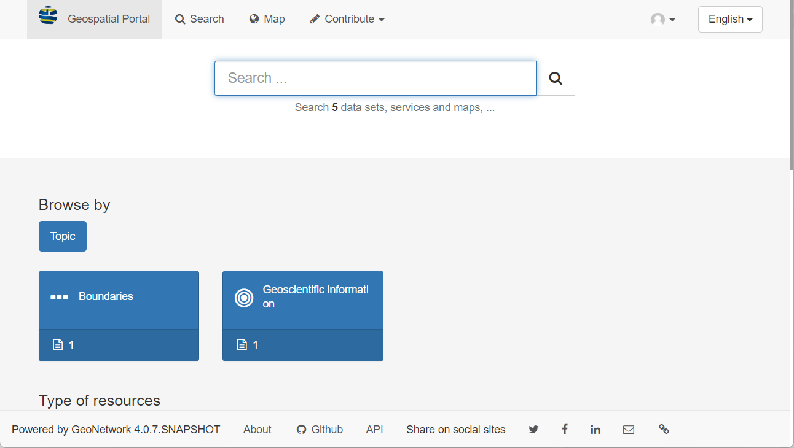

### Sign into the Catalog

Click the sign in button located in the top right corner.

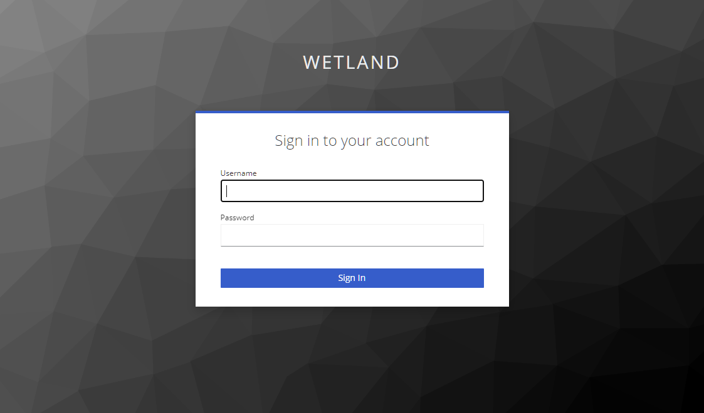

### Searching Records

Click the search button in the top left corner, the searching page will show up.

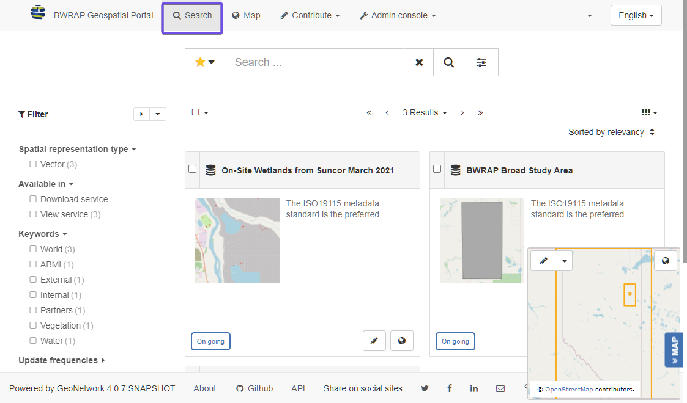

### Discovering information

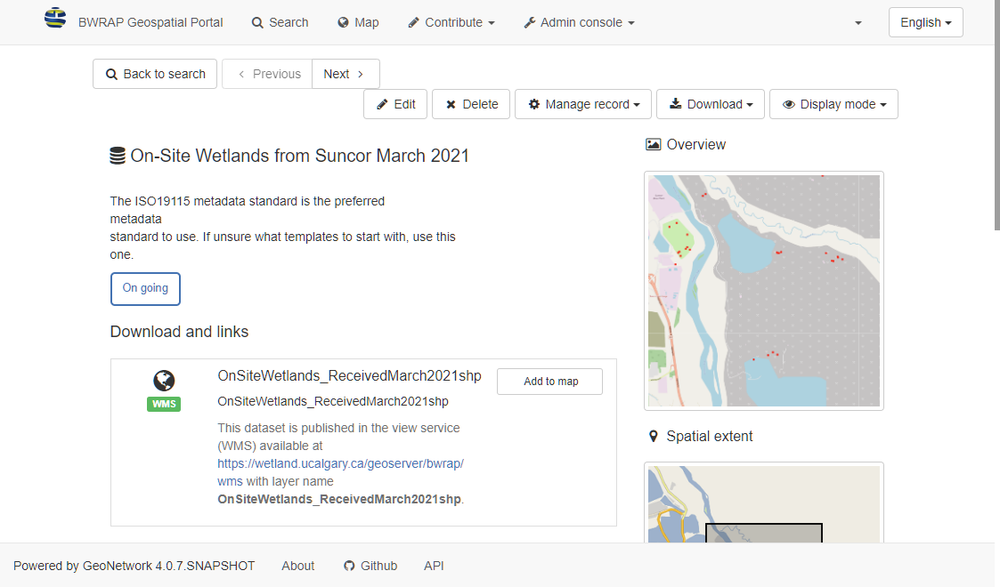

## Metadata Management

This is the most used functionalities for geospatial portal. For more detailed instructions please refer to [GeoNetwork User Guide](https://geonetwork-opensource.org/manuals/trunk/en/user-guide/index.html)

### Creating new record

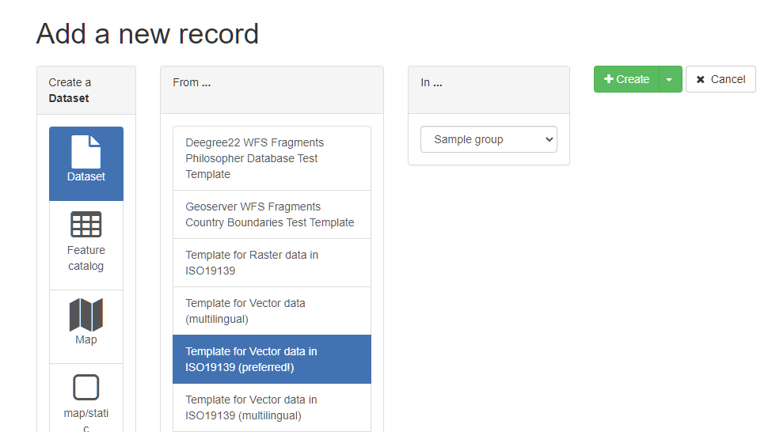

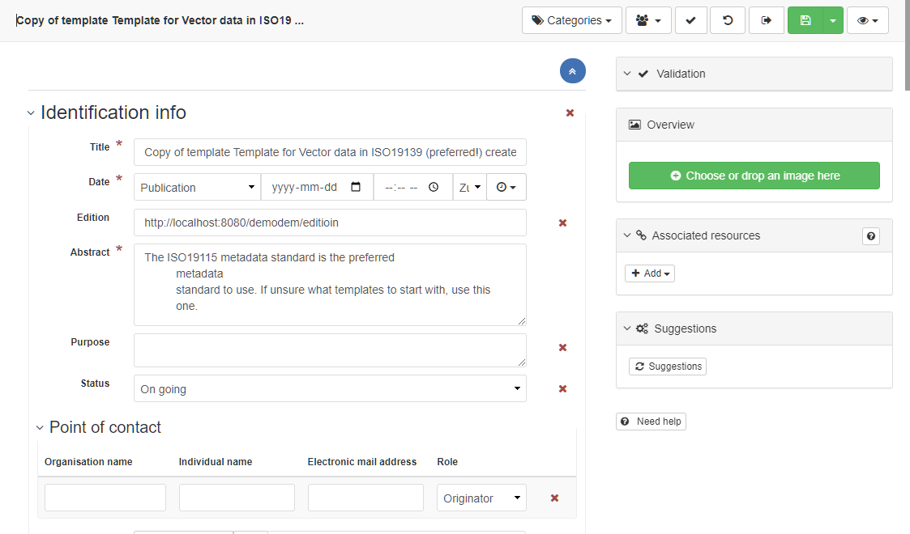

Once finishing inputting all the information of the record, click the
save and close button to save the record.

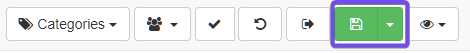

### Editing metadata

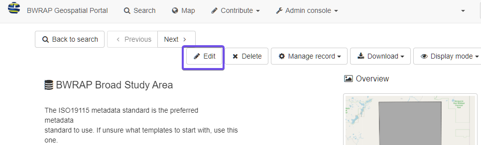

The editing interface will show up. The interface is the same as creating a new record.

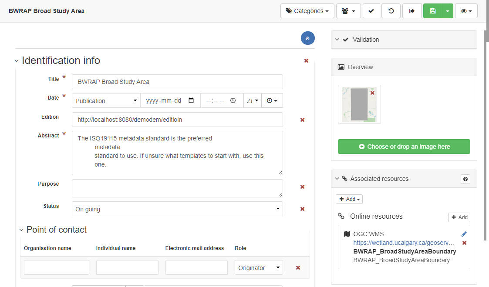

Update the information and save the record.

### Associating resources

Adding thumbnail:

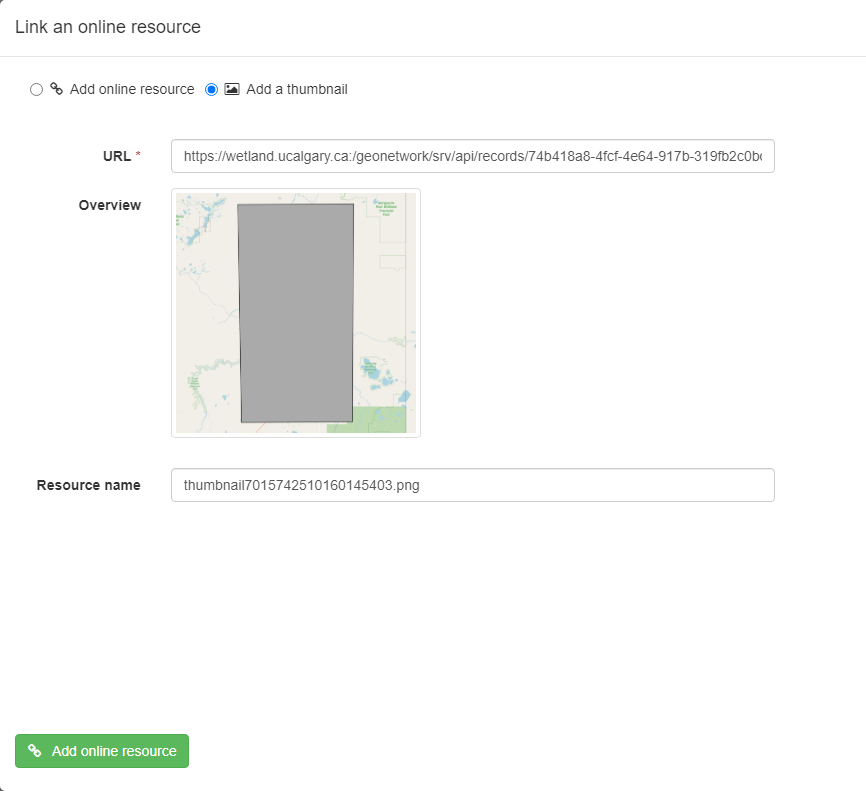

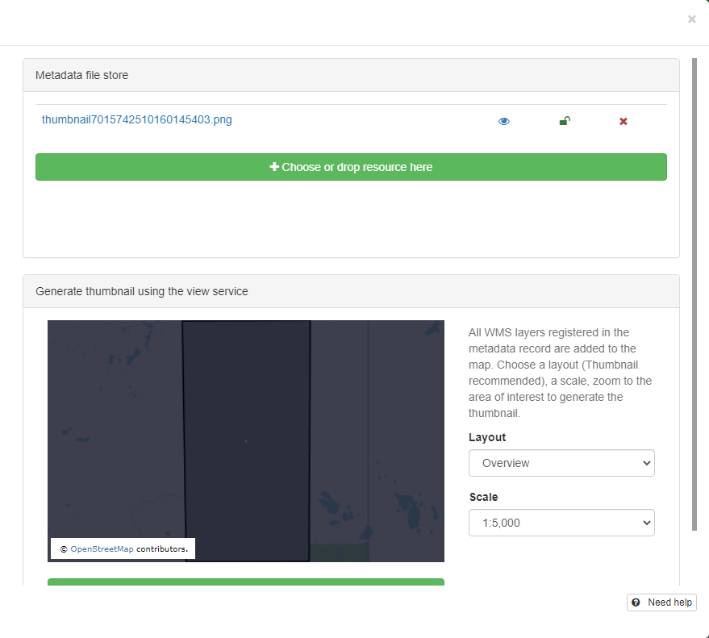

Adding online resources:

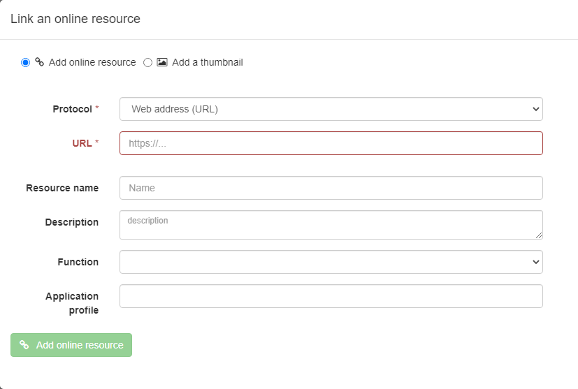

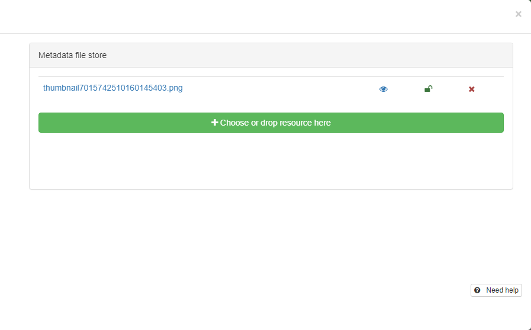

## Classify information

### Tagging with categories

n the searching page, select the record(s), and click the **Selected** button,

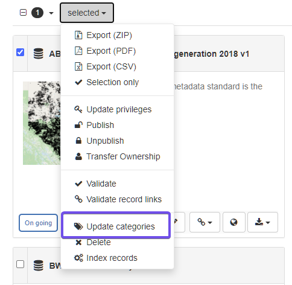

and in the drop down list, click **Update categories**.

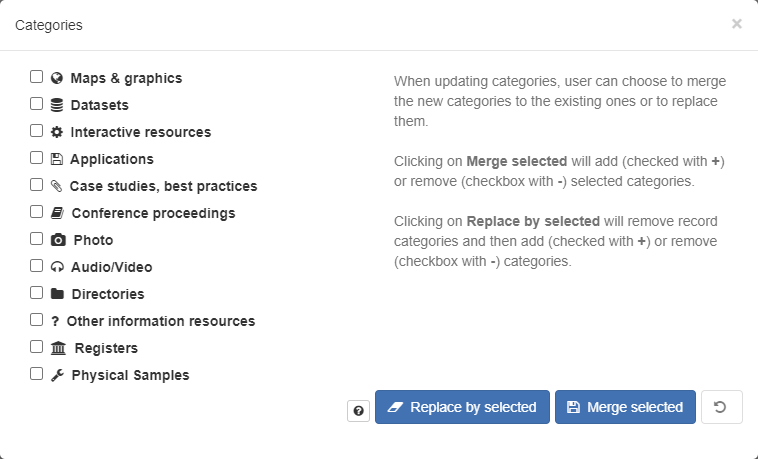

### Tagging with keywords

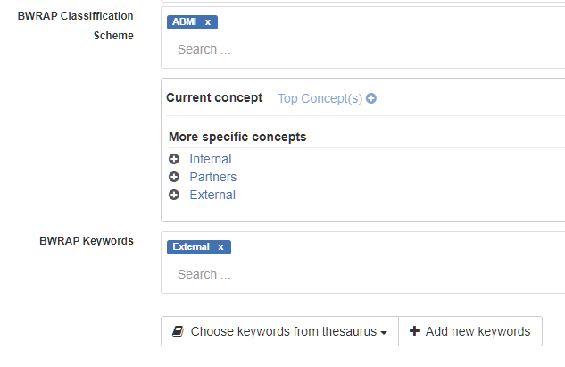

## Publishing

### Managing privileges

There are 5 privileges for records:

- **Publish**: Users in the specified group(s) are able to view the metadata eg. if it matches search criteria entered by such a user.
- **Download**: Users in the specified group(s) are able to download the data.
- **Interactive Map**: Users in the specified group(s) are able to get an interactive map. The interactive map has to be created separately using a Web Map Server such as GeoServer, which is distributed with GeoNetwork.
- **Editing**: When randomly selected by GeoNetwork, the metadata record can appear in the Featured section of the GeoNetwork home page.
- **Notify**: Users in the specified group(s) receive notification if data attached to the metadata record is downloaded.

### Setting Privileges

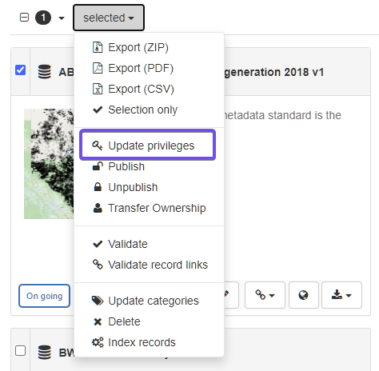

The privileges can also be set through metadata view.

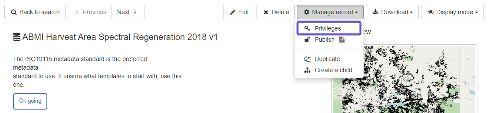

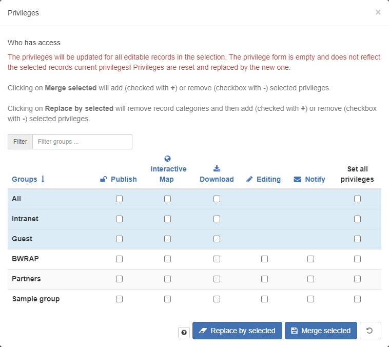

### Transferring privileges

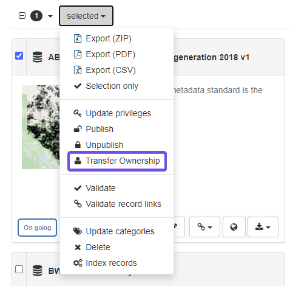

Click the dropdown list, and select the user you want to transfer
ownership to.

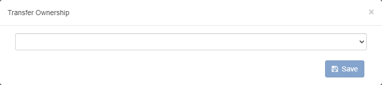

## Exporting records

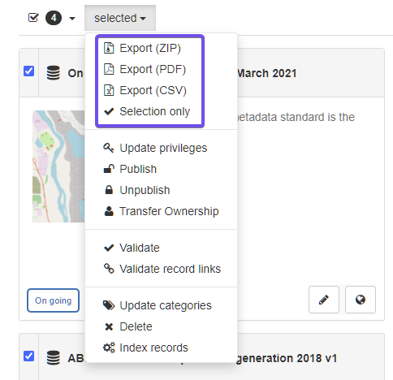

There are three types of exportations:

- Export as a ZIP archive
- Export as a CSV file
- Export as PDF

ZIP archive is recommended for exporting and importing.

## References

1. Spatial Data on the Web Best Practices

    <https://www.w3.org/TR/sdw-bp/>

2. California Open Data Publisher's Handbook

   <https://docs.data.ca.gov/california-open-data-publishers-handbook/>

3. EPA GeoPlatform Data Publishing Workflow Standard Operating Procedure
    <https://19january2017snapshot.epa.gov/sites/production/files/2015-11/documents/epa_datapublishing_workflow_sop_v1.2_20150930_dig_strategy.pdf>

4. Prepare data to publish a feature service
    <https://enterprise.arcgis.com/en/server/latest/publish-services/linux/prepare-data-for-feature-services.htm>

5. Guidance on submitting geospatial data
    <https://www.canada.ca/en/impact-assessment-agency/services/policy-guidance/practitioners-guide-impact-assessment-act/guidance-submitting-geospatial-data.html>